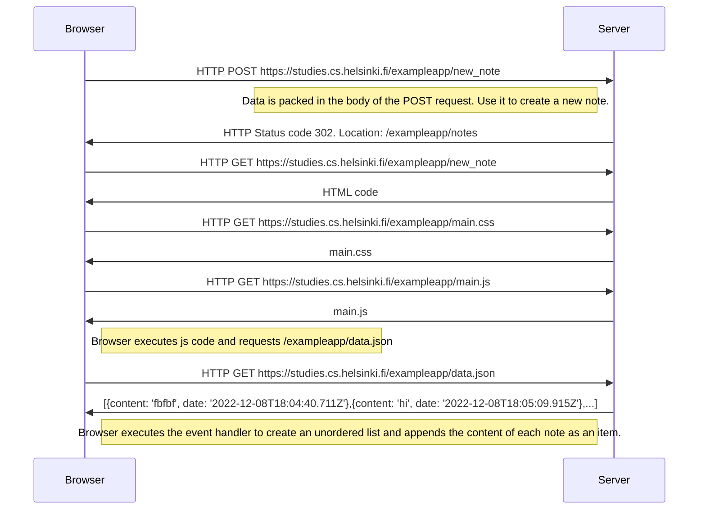

```mermaid
sequenceDiagram
Browser->>Server: HTTP POST https://studies.cs.helsinki.fi/exampleapp/new_note
Note left of Server: Data is packed in the body of the POST request. Use it to create a new note.
Server->>Browser: HTTP Status code 302. Location: /exampleapp/notes
Browser->>Server: HTTP GET https://studies.cs.helsinki.fi/exampleapp/new_note
Server->>Browser: HTML code
Browser->>Server: HTTP GET https://studies.cs.helsinki.fi/exampleapp/main.css
Server->>Browser: main.css
Browser->>Server: HTTP GET https://studies.cs.helsinki.fi/exampleapp/main.js
Server->>Browser: main.js
Note right of Browser: Browser executes js code and requests /exampleapp/data.json
Browser->>Server: HTTP GET https://studies.cs.helsinki.fi/exampleapp/data.json
Server->>Browser: [{content: 'fbfbf', date: '2022-12-08T18:04:40.711Z'},{content: 'hi', date: '2022-12-08T18:05:09.915Z'},...]
Note right of Browser: Browser executes the event handler to create an unordered list and appends the content of each note as an item.
```