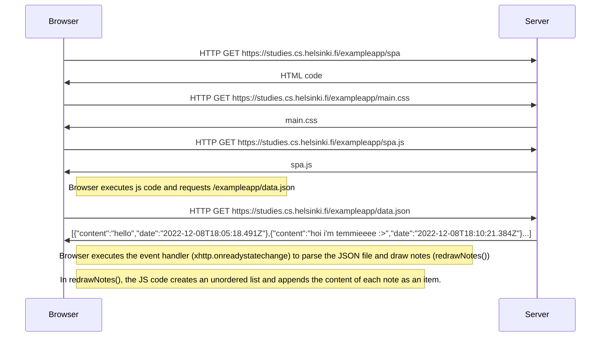

```mermaid
sequenceDiagram
Browser->>Server: HTTP GET https://studies.cs.helsinki.fi/exampleapp/spa
Server->>Browser: HTML code
Browser->>Server: HTTP GET https://studies.cs.helsinki.fi/exampleapp/main.css
Server->>Browser: main.css
Browser->>Server: HTTP GET https://studies.cs.helsinki.fi/exampleapp/spa.js
Server->>Browser: spa.js
Note right of Browser: Browser executes js code and requests /exampleapp/data.json
Browser->>Server: HTTP GET https://studies.cs.helsinki.fi/exampleapp/data.json
Server->>Browser: [{"content":"hello","date":"2022-12-08T18:05:18.491Z"},{"content":"hoi i'm temmieeee :>","date":"2022-12-08T18:10:21.384Z"}...]
Note right of Browser: Browser executes the event handler (xhttp.onreadystatechange) to parse the JSON file and draw notes (redrawNotes())
Note right of Browser: In redrawNotes(), the JS code creates an unordered list and appends the content of each note as an item.
```