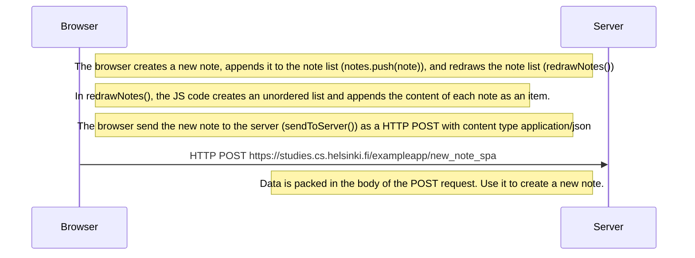

```mermaid
sequenceDiagram
Note right of Browser: The browser creates a new note, appends it to the note list (notes.push(note)), and redraws the note list (redrawNotes())
Note right of Browser: In redrawNotes(), the JS code creates an unordered list and appends the content of each note as an item.
Note right of Browser: The browser send the new note to the server (sendToServer()) as a HTTP POST with content type application/json
Browser->>Server: HTTP POST https://studies.cs.helsinki.fi/exampleapp/new_note_spa
Note left of Server: Data is packed in the body of the POST request. Use it to create a new note.
```